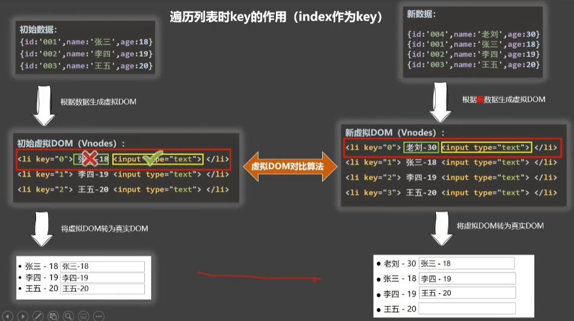

### 028-条件渲染（11）

1. v-if

   写法：

   - v-if="表达式"
   - v-else-if="表达式"
   - v-else="表达式"

   适用于：切换效率较低的场景

   特点：不展示DOM元素直接被移除

   NOTE：v-if可以和——v-else-if、v-else一起使用，但要求结构不能被“打断”！

2. v-show

   写法：v-show="表达式"

   适用于：切换频率较高的场景

   特点：不展示DOM元素未被移除，仅仅是使用样式隐藏掉

NOTE：使用v-if时，元素可能无法获取到，而使用v-show一定可以获取到

### 029-列表渲染（12）

v-for指令

1. 用于展示列表数据
2. 语法：v-for="(item, index) in xxx" :key="yyy"
3. 可遍历：数组、对象、字符串（用的很少）、指定次数（用的很少）

### 030-Key的作用与原理

**面试题**：react、Vue中的key有什么作用？（key的内部原理）

1. 虚拟DOM中key的作用：

   key是虚拟DOM对象的标识，当状态中的数据发生变化时，Vue会根据【新数据】生成【新的虚拟DOM】，随后Vue进行【新虚拟DOM】与【旧虚拟DOM】的差异比较，比较规则如下

2. 对比规则：

   - 旧虚拟DOM中找到与新虚拟DOM相同的Key：
     - 若虚拟DOM中内容没变，直接使用之前的真实DOM
     - 若虚拟DOM中内容变了，则生成新的真实DOM，随后替换掉页面中之前的真实DOM
   - 旧虚拟DOM中未找到与新虚拟DOM相同的key
     - 创建新的真实DOM，随后渲染到页面。

3. 用index作为key可能会引发的问题：

   - 若对数据进行：逆序添加、逆序删除等破坏顺序操作：会产生没有必要的真实DOM更新 ==> 界面效果没问题，但效率低。
   - 如果结构中还包含输入类的DOM:会产生错误DOM更新 ==> 界面有问题。

4. 开发中如何选择key?

   - 最好使用每条数据的唯一标识作为key，比如id、于机号、身份证号、学号等唯一值。
   - 如果不存在对数据的逆序添加、逆序删除等破坏顺序操作，仅用于渲染列表用于展示，使index作为key是没有问题的。

### 031-列表过滤（12-3）

