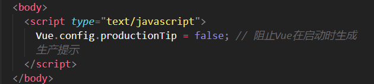
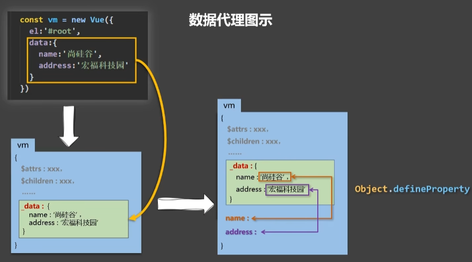
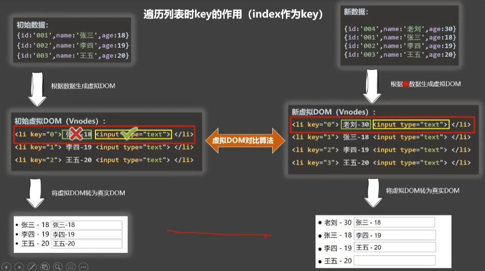
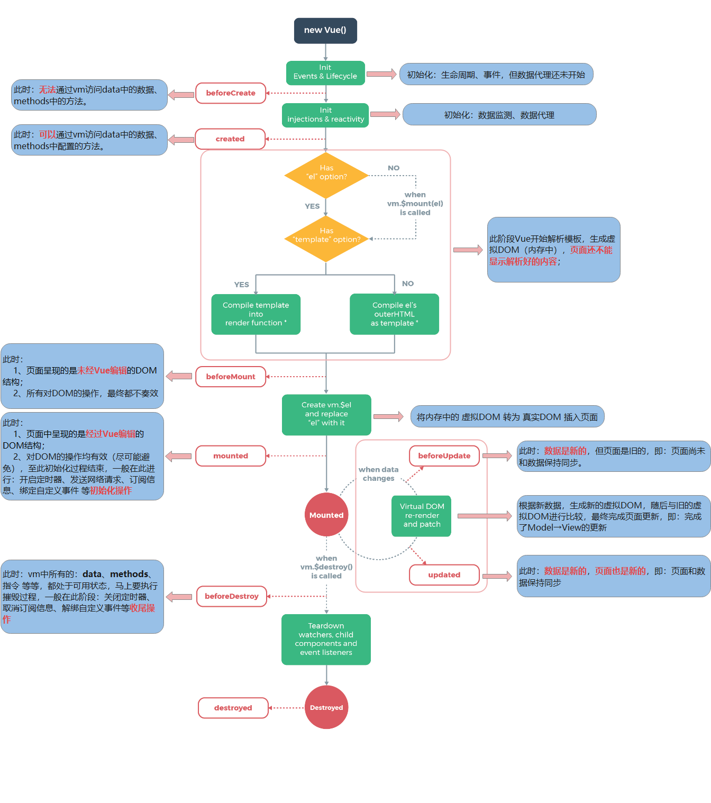

# Vue

## 01-初识Vue

### 004-搭建开发环境

#### 引入Vue的方法

1. 下载vue.js，在项目中的html文件中引用

   `<script type="text/javascript" src="../js/vue.js"></script>`

2. 借助script标签直接通过CDN来使用Vue：

   Vue2：

   `<script src="https://cdn.jsdelivr.net/npm/vue@2.6.14/dist/vue.js"></script>`

   Vue3：

   `<script src="https://unpkg.com/vue@3/dist/vue.global.js"></script>`

#### 下载开发者扩展程序

地址：https://github.com/vuejs/devtools

#### 阻止Vue在启动时生成生产提示



### 005-Hello小案例

先说总结：

1. 想让Vue工作，就必须创建一个Vue实例，且要传入一个配置对象；
2. root容器里的代码依然符合html规范，只不过混入了一些特殊的Vue语法；
3. root容器里代码被称为**Vue模板**；

代码：

```vue
<!DOCTYPE html>
<html lang="en"> 
<head>
    <meta charset="UTF-8" />
    <meta http-equiv="X-UA-Compatible" content="IE=edge" />
    <meta name="viewport" content="width=device-width, initial-scale=1.0" />
    <title>Document</title>

    <!-- 引入Vue -->
    <script
      type="text/javascript"
      src="https://cdn.jsdelivr.net/npm/vue@2.6.14/dist/vue.js"
    ></script>
  </head>
  <body>
    <!-- 准备好一个容器 -->
    <div id="root">
      <!-- 插值语法 -->
      <h1>Hello, {{name}}!</h1>
    </div>
    <script type="text/javascript">
      Vue.config.productionTip = false; // 阻止Vue在启动时生成生产提示

      // 创建Vue实例，Vue里只传一个参数，类型是个对象--{}配置对象
      new Vue({
        el: '#root', // element,用于指定当前Vue实例为哪个容器服务，值通常为css选择器字符串('#root')，也可以是'document.getElementById('root')'
        data: {
          //data中用于存储数据，数据供el所指定的容器去使用。值先暂时先写成一个对象。
          name: 'Mona',
        },
      });
    </script>
  </body>
</html>
```

### 006-分析Hello案例（01）

总结：

1. 容器和实例是一一对应的；
2. {{xxx}}中的xxx要写**js表达式**！并且xxx可以自动读取到data中的所有属性，注意区分 **js表达式** 和 **js代码** ：
   - js表达式：一个表达式会生成一个值，可以放在任何一个需要值的地方：
     1. a
     2. a+b
     3. demo(1)
     4. x === y ? 'a' : 'b'
   - js代码：语句
     1. if(){}
     2. for(){}
3. 真实开发中，只有一个Vue实例，并且会配合组件一起使用；
4. 一旦data中的数据发生改变，那么模板中用到该数据的地方也会自动更新。

### 007-模板语法（02）

#### 插值语法与指令语法

1. 插值语法
   - 功能：用于解析标签体内容（写在<>中间这部分的内容<>）
   - 写法：{{xxx}}，xxx是js表达式，且可以直接读取到data中的所有属性。
2. 指令语法
   - 功能：用于解析标签（包括标签属性、标签体内容、绑定事件等）
   - 举例：`v-bind:href="xxx"` 或简写为 `:href="xxx"`，xxx同样要写成js表达式的形式，且可以直接读取到data中的所有属性。
   - 备注：Vue中有很多指令，且形式都是：v-xxxx，v-bind只是个例子。

### 008-数据绑定（03）

#### 单向数据绑定和双向数据绑定

1. 单向数据绑定（v-bind）：数据只能从data流向页面
2. 双向数据绑定（v-model）：数据不仅能从data流向页面，还可以从页面流向data。

NOTE：

- 双向绑定一般都应用在表单类元素上，比如input、select等
- `v-model:value`可以简写为 v-model，因为v-model默认收集的就是value的值

### 009-el与data的两种写法（04）

#### el的两种写法

1. new Vue的时候配置el属性
2. 先创建Vue实例，随后再通过vm.$mount('#root')指定el的值

#### data的两种写法

1. 对象式

   ```vue
   data:{
   	name:'mona',
   }
   ```

2. 函数式

   ```vue
   data:function(){
   	name:'mona',
   }
   或者
   data(){
   	return{
   		name:'mona',
   	}
   }
   ```

选择方式：学习到组件时，data必须使用函数式，否则会报错；

NOTE：用Vue管理的函数，不可以写成箭头函数，一旦写了，this就不再是Vue实例了。

### 010-MVVM模型（05）

1. MVVM定义：

   M：模型（model）：data中的数据

   V：视图（View）：模板代码

   VM：视图模型（ViewModel）：Vue实例

NOTE：观察发现

	1. data中的所有属性，最后都出现在了vm身上；
	2. vm身上的所有属性，以及 Vue原型上的所有属性，在Vue模板中都可以直接使用。

### 011-Object.defineProperty()（06-1）

1. 写法：`Object.defineProperty(obj, 'property', {descriptor})`

2. 控制属性的方法：

```vue
<body>
    <script>
        let number = 18;
        let person = {
            name='Mona',
        }
        
        Object.defineProperty(person,'age',{
            // 1. 控制属性是否可以枚举，默认值为false
            enumerable: true;
            // 2. 控制属性是否可以被修改，默认值为false
            writeable: true;
            // 3. 控制属性是否可以被删除，默认值为false
            configurable: true;
            // 4. 当有人读取person的age属性时，get函数就会被调用，且返回值就是age的值
            get:function(){
            	console.log('有人读取了age属性')
            	return number
        	}
        	// 可以简写为：
        	get(){
                console.log('有人读取了age属性')
                return number
            }
        	// 5. 当有人修改person的age属性时，get函数（getter）就会被调用，且会收到修改的具体值
        	set(value){
                console.log('有人修改了age属性，并且值为vaule')
                number = value;
            }
        })
    </script>
</body>
```

### 012-什么是数据代理（06-2）

数据代理：通过一个对象代理对另一个对象中属性的操作  读/写

```vue
 <script>
      let obj = { x: 100 };

      let obj2 = { y: 200 };
      Object.defineProperty(obj2, 'x', {
        get() {
          return obj.x;
        },
        set(value) {
          obj.x = value;
        },
      });
    </script>
```

### 013-Vue中的数据代理（06-3）



通过vm对象来代理data对象中属性的操作（读/写）

好处：更加方便的操作data中的数据

**基本原理**：

​	通过`Object.defineProperty()`把data对象中所有属性添加到vm上；

​	为每一个添加到vm上的属性，都指定一个getter/setter；

​	在getter/setter内部去操作（读/写）data中对应的属性。


### 014-事件处理（07-1）

事件的基本使用：

1. 使用`v-on:xxx` 或者 `@xxx`绑定事件，其中xxx是事件名，比如click等；

2. 事件的回调需要配置在`method`对象中，最终会在vm上；

3. method中配置的函数，不要用箭头函数，否则this不会指向vm；

4. method中配置的函数，都是被Vue管理的函数，this的指向是vm 或者 组件实例对象；

5. `@click="demo"` 和 `@click="demo($event)"`效果一致，但后者可以传参。

   ```vue
    <body>
       <div id="root">
         <h2>欢迎{{name}}来学习呀</h2>
         <!-- 点击button时 显示shouInfo -->
         <button v-on:click="showInfo1">点我提示信息1(不传参)</button>
         <button @click="showInfo2($event,66)">点我提示信息2(传参)</button>
       </div>
     </body>
   
     <script>
       const vm = new Vue({
         el: '#root',
         data() {
           return {
             name: 'Mona',
           };
         },
         methods: {
           showInfo1(event) {
             // console.log(event.target.innerText);
             // console.log(this == vm);// 此处的this是vm（vue实例对象）
             alert('你好~');
           },
           showInfo2(event, number) {
             console.log(number);
             console.log(event.target.innerText);
             // console.log(this == vm);// 此处的this是vm（vue实例对象）
             alert('你好呀~');
           },
         },
       });
     </script>
   ```

   

### 015-事件修饰符（07-2）

Vue中的事件修饰符：

1. **prevent**：阻止默认事件（常用）
2. **stop**：阻止事件冒泡（常用）
3. **once**：事件只触发一次（常用）
4. **capture**：使用时间的捕获模式；
5. **self**：只有event.target是当前操作的元素时才触发事件；
6. **passive**：事件的默认行为立即执行，无需等待事件回调执行完毕。

NOTE：修饰符可以连续写，比如：`@click.stop.prevent`

### 016-键盘事件（08-3）

1. Vue中常用的按键别名

   - 回车 => enter
   - 删除 => delete(捕获"删除"和"退格"键)
   - 退出 => esc
   - 空格 => space
   - 换行 => tab(特殊，必须配合keydown使用)
   - 上 => up
   - 下 => down
   - 左 => left
   - 右 => right

2. Vue未提供别名的案件，可以使用按键原始的key值绑定，但注意要转为kebab-case（短横线命名）比如CapsLock需要写成caps-lock

3. 系统修饰键（用法特殊）：ctrl alt shift meta

   1. 配合keyup使用：按下修饰键的同时再按下其他键，随后释放其他键，事件才被触发。
   2. 配合keydown使用：正常触发事件。

   NOTE: 按ctrl+y触发事件这种情况，可以使用`@click.ctrl.y`

4. 也可以使用keyCode去指定具体的按键（不推荐）

5. Vue.config.keyCodes.自定义键名 = 键码，可以去定制按键别名

### 019-计算属性（08-1 2 3）

1. 定义：要用的属性不存在，要通过已有的属性计算得来
2. 原理：底层借助了Object.defineproperty方法提供的getter和setter
3. get函数什么时候执行？
   1. 初次读取fullName时；
   2. 所依赖的数据（用到的数据）发生变化时
4. 优势：与methods实现相比，内部有缓存机制（复用），效率更高，调试方便

NOTE：

1. 计算属性最终会出现在vm上，直接读取使用即可
2. 如果计算属性要被修改，必须写上set函数去响应修改，且set中要引起计算时依赖的数据发生改变。

### 020-计算属性-简写（08-4）

确定只读不改，就可以简写

```js
computed: {
        // 完整写法
        /* fullName: {
          get() {
            console.log('get被调用了');
            return this.firstName + '-' + this.secondName;
          },
          set(value) {
            console.log('set', value);
            const arr = value.split('-');
            this.firstName = arr[0];
            this.secondName = arr[1];
          },
        }, */
        // 简写
        // function当getter用
        /* fullName: function () {
          return this.firstName + '-' + this.secondName;
        }, */
        // 也可以这么写
        fullName() {
          return this.firstName + '-' + this.secondName;
        },
      },
```

### 022-监视属性（09-2）

监视属性watch：

1. 当被监视的属性变化时，回调函数自动调用，进行相关操作
2. 监视的属性必须存在，才能进行监视
3. 监视的两种写法
   1. new Vue时传入watch配置
   2. 通过vm.$watch监视

深度监视：

1. Vue中的watch默认不监测对象内部值的改变（一层）
2. 配置deep:true可以检测对象内部值改变（多层）

NOTE：

1. Vue自身可以监测对象内部值的改变，但Vue提供的watch默认不可以
2. 使用watch时根据数据的具体结构，决定是否采用深度监视。


computed和watch之间的区别：

1. computed能完成的功能，watch都能完成
2. watch能完成的功能，computed不一定能完成，比如：watch可以实现异步操作；

NOTE：

1. 所被Vue管理的函数，最好都写成普通函数，这样this的指向才是vm或组件实例对象
2. 所有不被Vue管理的函数（定时器的回调函数、ajax的回调函数等）最好写成箭头函数，这样this的指向才是vm或组件实例对象


### 026-绑定class样式(10-1)

绑定样式

1. class样式

   写法：class="xxx"  xxx可以是字符串、对象、数组

   字符串写法适用于：类名不确定，要动态获取的情况；

   对象写法适用于：要绑定多个样式，个数不确定、名字也不确定；

   数组写法适用于：要绑定多个样式，个数确定，名字也确定，但不确定用不用；

2. style样式

   :style="{fontSize: xxx}" 其中xxx是动态值；

   :style="[a, b]" 其中a b是样式对象；

### 028-条件渲染（11）

1. v-if

   写法：

   - v-if="表达式"
   - v-else-if="表达式"
   - v-else="表达式"

   适用于：切换效率较低的场景

   特点：不展示DOM元素直接被移除

   NOTE：v-if可以和——v-else-if、v-else一起使用，但要求结构不能被“打断”！

2. v-show

   写法：v-show="表达式"

   适用于：切换频率较高的场景

   特点：不展示DOM元素未被移除，仅仅是使用样式隐藏掉

NOTE：使用v-if时，元素可能无法获取到，而使用v-show一定可以获取到

### 029-列表渲染（12）

v-for指令

1. 用于展示列表数据
2. 语法：v-for="(item, index) in xxx" :key="yyy"
3. 可遍历：数组、对象、字符串（用的很少）、指定次数（用的很少）

### 030-Key的作用与原理



**面试题**：react、Vue中的key有什么作用？（key的内部原理）

1. 虚拟DOM中key的作用：

   key是虚拟DOM对象的标识，当状态中的数据发生变化时，Vue会根据【新数据】生成【新的虚拟DOM】，随后Vue进行【新虚拟DOM】与【旧虚拟DOM】的差异比较，比较规则如下

2. 对比规则：

   - 旧虚拟DOM中找到与新虚拟DOM相同的Key：
     - 若虚拟DOM中内容没变，直接使用之前的真实DOM
     - 若虚拟DOM中内容变了，则生成新的真实DOM，随后替换掉页面中之前的真实DOM
   - 旧虚拟DOM中未找到与新虚拟DOM相同的key
     - 创建新的真实DOM，随后渲染到页面。

3. 用index作为key可能会引发的问题：

   - 若对数据进行：逆序添加、逆序删除等破坏顺序操作：会产生没有必要的真实DOM更新 ==> 界面效果没问题，但效率低。
   - 如果结构中还包含输入类的DOM:会产生错误DOM更新 ==> 界面有问题。

4. 开发中如何选择key?

   - 最好使用每条数据的唯一标识作为key，比如id、于机号、身份证号、学号等唯一值。
   - 如果不存在对数据的逆序添加、逆序删除等破坏顺序操作，仅用于渲染列表用于展示，使index作为key是没有问题的。

### 037-Vue监测数据的原理（12-5）

1. Vue会监视data中所有层次的数据

2. 如何监测对象中的数据？

   通过setter实现监视，且要在new Vue时就传入要监测的数据

   - 对象中后追加的属性，Vue默认不做响应式处理
   - 如需给后添加的属性做响应式，请使用如下API
     - Vue.set(target, propertyName/index, value)
     - vm.$set(target, propertyName/index, value)

3. 如何监测数组中的数据？

   通过包裹数组更新元素的方法实现，本质就是做了两件事

   1. 调用原生对应的方法对数组进行更新；
   2. 重新解析模板，进而更新页面。

4. 在Vue修改数组中的某个元素一定要用如下方法：

   1. 使用这些API：`push() pop() shift() unshift() splice() sort() reverse()`
   2. `Vue.set()` 或`vm.$set`

NOTE : `Vue.set()`和`vm.$set()`不能给vm或vm的跟数据对象添加属性。

### 038-收集表单数据（13-1）

ajax：可以页面无刷新的获取数据，也可以无刷新把数据送走


### 039-内置指令

内置指令

1. v-bind：单向绑定解析表达式，可简写为 `:xxx`
2. v-model：双向数据绑定
3. v-for：遍历数组/对象/字符串
4. v-on：绑定事件监听，可简写为`@`
5. v-if：条件渲染（动态控制节点是否存在）
6. v-else：条件渲染（动态控制节点是否存在）
7. v-show：条件渲染（动态控制节点是否展示）
8. v-text：作用——向其所在的节点中渲染文本内容； 与插值语法的区别——v-text会替换掉节点中的内容，{{xx}}则不会
9. v-html
   1. 作用——向指定节点中渲染包含html结构的内容； 
   2. 与插值语法的区别
      1. v-html会替换掉节点中所有的内容，{{xxx}}则不会；
      2. v-html可以识别html结构
   3. NOTE：v-html有安全性问题
      1. 在网站上动态渲染任意html是非常危险的，容易导致XSS攻击
      2. 一定要在可信的内容上使用v-html，永远不要在用户提交的内容上使用。
10. v-cloak：（没有值）
    1. 本质是一个特殊属性，Vue实例创建完毕并接管容器后，会删掉v-clock属性
    2. 使用css配合v-cloak可以解决网速慢时页面展示出{{xxx}}的问题。
11. v-once：（没有值）
    1. v-once所在节点在初次动态渲染后，就视为静态内容了
    2. 以后数据的改变不会引起v-once所在结构的更新，可以用于优化性能。
12. v-pre：（没有值）
    1. 跳过其所在节点的编译过程
    2. 可利用它跳过：没有使用指令的语法、没有使用插值语法的节点，会加快编译

### 047-自定义指令总结

#### 1. 定义语法

1. 局部指令

   ```js
   new Vue({directives:{指令名:配置对象}})
   ```

   or

   ```js
   new Vue({directives{指令名:回调函数}})
   ```

2. 全局指令

   ```js
   Vue.directive(指令名, 配置对象)
   ```

   or

   ```js
   Vue.directive(指令名, 回调函数)
   ```

#### 2. 配置对象中常用的3个回调

1. bind：指令与元素成功绑定时调用；
2. inserted：指令所在元素被插入页面时调用；
3. update：指令所在模板结构被重新解析时调用；

NOTE：

1. 指令定义时不加v-，但使用时要加v-
2. 指令名如果是多个单词，需要使用kebab-case命名方式，不要用camelCase命名

### 048-生命周期

1. 生命周期，又名生命周期回调函数、生命周期函数、生命周期钩子

2. 是什么？——Vue在关键时刻帮我们调用的一些特殊名称的函数

3. 生命周期的函数名字不可更改，但函数的具体内容是程序员根据需求编写的

4. 生命周期中的this指向的是vm或者组件实例对象

### 052-生命周期总结

vm的生命周期：

1. 将要创建——调用beforeCreate函数
2. 创建完毕——调用create函数
3. 将要挂在——调用beforeMount函数
4. **挂载完毕**——调用mounted函数**重要的钩子**
5. 将要更新——调用beforeUpdate函数
6. 更新完毕——调用update函数
7. **将要销毁**——调用beforeDestroy函数**重要的钩子**
8. 销毁完毕——调用destroyed函数

常用的生命周期钩子：

1. mounted：发送ajex请求、启动定时器、绑定自定义事件、订阅信息等【初始化操作】
2. beforeDestory：清除定时器、解绑自定义事件、取消订阅信息等【收尾工作】

关于销毁Vue实例

1. 销毁后借助Vue开发者工具看不到任何信息
2. 销毁后自定义事件会失效，但原生DOM事件依然有效
3. 一般不会在beforeDestory操作数据，因为即使操作数据，也不会再触发更新流程了



## 02-Vue组件化编程

### 053-模块与组件、模块化与组件化

1. 模块
   - 理解：向外提供特定功能的js程序，一般就是一个js文件
   - 为什么：js文件很多很复杂
   - 作用：复用js，简化js的编写，提高js运行效率
2. 组件
   - 理解：用来实现局部（特定）功能效果的代码集合（html/css/image…）
   - 为什么：一个界面的功能很复杂
   - 作用：复用编码，简化项目编码，提高运行效率
3. 模块化：当应用中的js都以模块来编写，那这个应用就是一个模块化应用
4. 组件化： 当应用中的功能都是多组件的方式来编写的，那这个应用就是一个组件化的应用


### 054-非单文件组件与单文件组件

1. 非单文件组件：一个文件中包含有n个组件
2. 单文件组件：一个文件中只包含有1个组件

#### Vue中使用组件的三个步骤

1. 定义组件（创建组件）
2. 注册组件
3. 使用组件（写组件标签）

#### 1. 如何定义一个组件？

使用`Vue.extend(option)`创建，其中`options`和`new Vue(options)`时传入的那个options几乎一样，但也有区别：

1. el不要写！！（因为最终所有的组件都要经过一个vm的管理，由vm中的el决定服务哪个容器
2. data必须写成函数（因为要避免组件被复用时，数据存在引用关系）

NOTE：使用template可以配置组件结构

#### 2. 如何注册组件？

1. 局部注册：靠new Vue的时候传入components选项
2. 全局注册：靠Vue.component('组件名'，组件)

#### 3. 编写组件标签

`<school></school>`

### 055-关于组件的几个注意点

#### 1. 关于组件名

一个单词组成：

1. 第一种写法（首字母小写）：school
2. 第二种写法（首字母大写）：School

多个单词组成：

1. 第一种写法（kebab-case命名）：'my-school'
2. 第二种写法（CamelCase命名）：MySchool（需要Vue脚手架支持）

NOTE：

1. 组件名尽可能回避HTML已有的元素名称
2. 可以使用name配置项指定组件在开发者工具中呈现的名字


#### 2. 关于组件标签

1. 第一种写法：`<school></school>`
2. 第二种写法：`<school />`

NOTE：不用使用脚手架时，`<school />`会导致后续组件不能渲染


#### 3. 一个简写方式

`const school = Vue.extend(options)` 可简写为 `const school = options`


### 057-VueComponent

1. school组件本质是一个名为**VueComponent**的构造函数，且不是程序员定义的，是**Vue.extend生成的**
2. 我们只需要写`<school>`或者`<school></school>`，Vue**解析时**会帮我们创建school组件的**实例对象**，即，Vue帮我们执行了：`new VueComponent(options)`

特别注意：**每次调用Vue.extend**，返回的都是一个**全新的VueComponent**！！！

3. 关于this指向

   1. 组件配置中：

      data函数、methods中的函数、watch中的函数、computed中的函数，他们 的this均是**VueComponent实例对象**

   2. new Vue()配置中：

      data函数、methods中的函数、watch中的函数、computed中的函数，他们的this均是**Vue实例对象**

4. VueComponent的实例对象，以后简称vc（也可以称之为：组件实例对象）；Vue的实例对象，以后简称vm

### 059-重要的内置关系

1. 重要内置关系：`VueComponent.prototype.__proto__ === Vue.peototype`
2. 为什么要有这个关系：让组件实例对象（vc）可以访问到Vue原型上的属性、方法